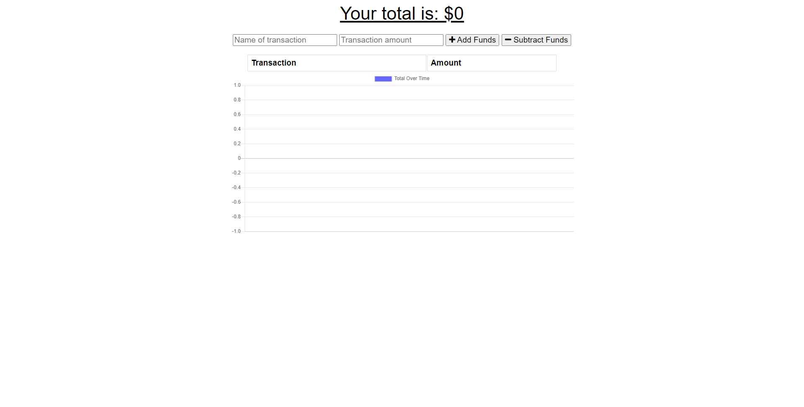
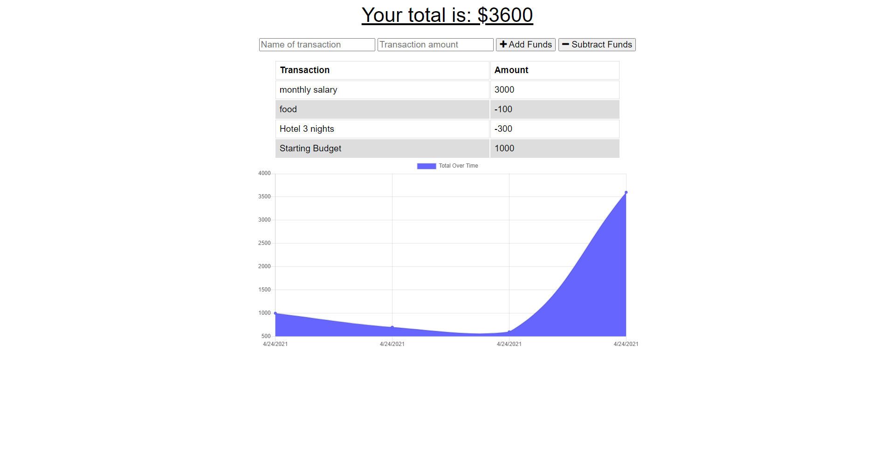

# 19-Budget-Tracker

## Purpose
This is a Progressive Web Application(PWA) project that will track a persons budget. This site gives the user a fast and easy way to track their money whether they're connected to the internet or not.

## Table of Contents
  * [Built With](#built-with)
  * [Screenshot](#screenshot)
  * [Links](#links)

## Built-With
- JavaScript
- MongoDB 
- Node
- Express 
- Mongoose
- IndexedBD
- Service Worker

## ScreenShots
* Screenshot of deployed website(with internet)   
  

* Screenshot of deployed website with sample budgets  
  

* Screenshot of deployed website(adding transaction with offline connections)
  

* Screenshot of deployed website(when reconnecting to interent)   
  

## Links
[Repo Link](https://github.com/jcc83267/19-Budget-Tracker)  
[Deployed Site Link](https://jcc83267-budget-tracker.herokuapp.com/) 
